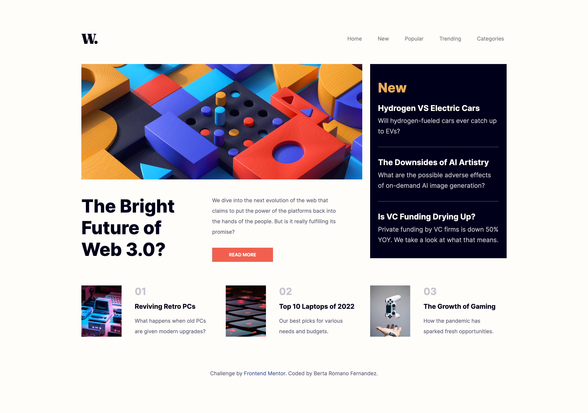

# News homepage main page

## Table of contents

- [Overview](#overview)
  - [The challenge](#the-challenge)
  - [Screenshot](#screenshot)
  - [Links](#links)
- [My process](#my-process)
  - [Built with](#built-with)
  - [What I learned](#what-i-learned)
  - [Useful resources](#useful-resources)
- [Author](#author)

## Overview

### The challenge

Users should be able to:

- View the optimal layout for the interface depending on their device's screen size
- See hover and focus states for all interactive elements on the page
- Toggle the mobile menu

### Screenshot

### Links

- Solution URL: [https://github.com/berta-rf/news-homepage-main](https://github.com/berta-rf/news-homepage-main)
- Live Site URL: [https://berta-rf.github.io/news-homepage-main](https://berta-rf.github.io/news-homepage-main)

## My process

### Built with

- Semantic HTML5 markup
- SCSS
- Boostrap 5.2
- Mobile-first workflow
- JavaScript

### What I learned

My major learnings while working through this project have been to create and offcanvas navigation for mobile view, and to work with nested grids on Bootstrap to have a column span more than one row.

### Useful resources

- [The Net Ninja - Bootstrap 5 Tutorial](https://www.youtube.com/watch?v=O_9u1P5YjVc&list=PL4cUxeGkcC9joIM91nLzd_qaH_AimmdAR) - This is a great 20 episode Boostrap 5 crash course. I'd recommend it to anyone starting with Bootstrap.

## Author

- GitHub - [berta-rf](https://github.com/berta-rf)
- LinkedIn - [Berta Romano Fernandez](https://www.linkedin.com/in/berta-romano-fernandez-85a51117a/)
- Frontend Mentor - [@berta-rf](https://www.frontendmentor.io/profile/)

